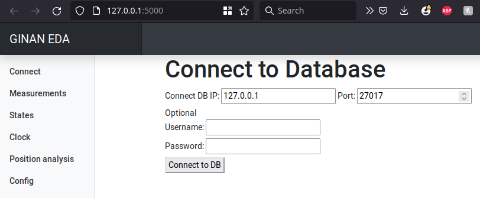

# GinanEDA

The Ginan Exploratory Data Analysis (EDA) application is a graphical interface that enables users to visualise Ginan output that has been stored in a MongoDB database.

GinanEDA is a Python application that uses *Flask* and *Python Plotly* to graphically render Ginan output in a web browser.

## Location

The GinanEDA application is located in the directory `ginan/scripts/GinanEDA`

## Installation

GinanEDA requires several Python modules to be installed. There are listed in the `requiremnts.txt` file and can be installed using `pip`.

```python
pip install -r requirements.txt
```

## Configuring Ginan for MongoDB Output

Before the GinanEDA can be used for visualisation, Ginan must be configured to write output into a MondoDB.

Refer to the the MongoDB setup instructions in the `readme` *MongoDB (PEA, optional)* section describing howto install, configure and start mongodb for your system.

## Configuring Ginan

To use the GinanEDA, Ginan needs to be configured to output some information into the MongoDB. 

This is done by configuring the `mongo:` section in the Ginan YAML configuration file

\include "exampleConfigs/mongo_outputs.yaml"

Refer to the [Configuring Ginan](page.html?c=on&p=ginanConfiguration.md) section of the documentation for details on the possible configuration options

## How to run the GinaEDA

To start the GinaEDA enter the command line.

```
python3 scripts/GinanEDA/index.py
```

If the MongoDB is running, the EDA will output to the terminal.

```
$ python3 index.py
 * Serving Flask app 'index'
 * Debug mode: off
WARNING: This is a development server. Do not use it in a production deployment. Use a production WSGI server instead.
 * Running on http://127.0.0.1:5000
Press CTRL+C to quit
```

## Visualisation in the Web browser

Render the html pages created by the GinanEDA by copy and pasting  http://127.0.0.1:5000/ into your browser URL finder.

You will see the GinanEDA home page rendered in your browser



In the column to the left are the options for loading data from the MongoDB and visualising their contents

#### Connect

The Connect tab brings up the connection page that enables you to select the database from MongoDB that you want to explore. 

Click on the `Connect to DB` and then the `Select databases` tabs to see a list of the databases names available for exploration. 

Click on the database you wish to load for visualisation and then click `Load DB`

The database names are configured in the ginan yaml configuration file using the `database: my_ginan_db` option.

#### Measuremenets

The `Measurments` tab brings up the page that enables you to visualise the `Measurments` and `Model Components` (if configured) used in the Ginan processing run.

#### States

The `States` tab brings up the page that enables you to visualise the estimated `States` their apriori values used in the Ginan processing run.

#### Clock Analysis

The `Clock` tab brings up the page that enables you to analyse the quality of the estimated `clock` states estimated in the Ginan processing run.

#### Position Analysis

The `Position Analysis` tab brings up the page that enables you to analyse the quality of the estimated receiver `position` states estimated in the Ginan processing run.

#### Config

The Config tab brings up a page that renders the Ginan input configuration file that was used in the processing.

