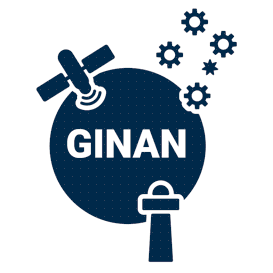

 

Ginan is an open source toolkit for creating precise point positioning (PPP) analysis products, correction streams and positions. It is being actively developed in a Geoscience Australia Positioning Australia program.

The source code for the current version of Ginan is available for download from [this site](https://github.com/GeoscienceAustralia/ginan). New versions of Ginan with enhanced capabilities will be developed and released over time.

Geoscience Australia is establishing operational instances of Ginan that produce PPP analysis [products and streams](page.html?c=on&p=products.md) on a continuous basis and which are available free of charge to the public.
