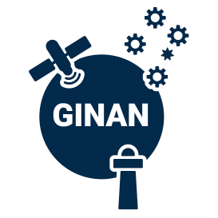

 
# Ginan: software toolkit and service

> **15 June 2022** - Geoscience Australia makes available new [CLK and SNX file products and 1059 and 1060 streams](page.html?p=products.md). Read the download and connection instructions [here](resources/GinanProductsStreamsAccess20220422.pdf).

> **24 May 2022** - Geoscience Australia presented [Ginan](resources/GinanBetaLocate22.pdf) at the [Locate 22](https://www.flickr.com/photos/146611946@N02/52099034032/in/album-72177720299363810/) conference in a workshop, and released an enhanced version (1.4) of the [Ginan software](https://github.com/GeoscienceAustralia/ginan).

Ginan is an open source toolkit for creating precise point positioning (PPP) analysis products, correction streams and positions. It is being actively developed in a Geoscience Australia Positioning Australia program.

The source code for the current version of Ginan is available for download from [this site](https://github.com/GeoscienceAustralia/ginan). New versions of Ginan with enhanced capabilities will be developed and released over time.

Geoscience Australia is establishing operational instances of Ginan that produce PPP analysis [products and streams](page.html?p=products.md) on a continuous basis and which are available free of charge to the public.
