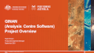
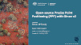
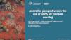
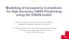
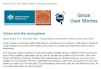
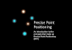

 
# Resources - documents and presentations

***

## Ginan presentations

> [ The Ginan project overview presentation from September 2022.](resources/GinanProjectOverview202209v01.pdf)

> [ The Ginan project technical review from March 2022.](resources/GinanTechnology20220318v01.pdf)

***

## Ginan user stories

> [ Open-source Precise Point Positioning (PPP) with Ginan v2 - Simon McClusky, from Locate 23, 11 May 2023.](resources/Locate23_S_McClusky_final.pdf)

> [ Australian perspectives on the use of GNSS for tsunami warning - Simon McClusky, Adrienne Moseley, Phil Cummins, Shin-Chan Han, John Dawson, from February 2023.](resources/TourDelIGS5_04_McClusky.pdf)

> [ Modelling of Ionospheric Corrections for High Accuracy GNSS Positioning using the GINAN toolkit - Tam Dao, from December 2022.](resources/TamDaoIonosphere.pdf)

> [ Using Ginan to analyse the ionosphere from December 2022.](resources/GinanIonosphere20221218v05.pdf)

***

## Reference

> [ Reference Frames from December 2021.](resources/ReferenceFrames20211209v01.pdf)

> [ Global Navigation Satellite Systems from July 2021.](resources/GNSS20211209v01.pdf)

> [ Standard Positioning Service from December 2021.](resources/SPS20211216v01.pdf)

> [ Precise Point Positioning from September 2021.](resources/PPP20211215v01.pdf)

> [ Precise Orbits and Clocks File (SP3) from July 2021.](resources/SP3-dQuickReferencev01.pdf)

***

## Market

> [ Precise Positioning Landscape from May 2021.](resources/GNSSLandscapev06.pdf)