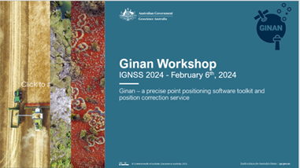
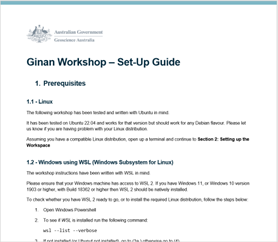
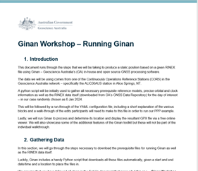
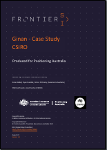
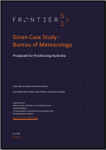
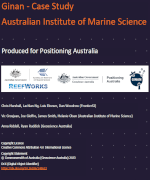

# Resources - documents and presentations

***

## Ginan Workshop Tutorial - IGNSS 2024 

> [ Slides from the Ginan Workshop hosted at the IGNSS 2024 conference.](resources/Ginan_Workshop_Slides_-_IGNSS_2024.pdf)

> [ Set Up Guide for the Ginan Workshop.](resources/Ginan_Workshop_1_Set-up_Guide_-_IGNSS_2024_-_6_Feb.pdf)

> [ Guide outlining how to run Ginan in the Workshop Tutorial.](resources/Ginan_Workshop_2_Running_Ginan_-_IGNSS_2024_-_6_Feb.pdf)

> [ Guide for those using Docker to run Ginan.](resources/Ginan_Workshop_Docker_Guide_-_IGNSS_2024_-_6_Feb.pdf)

***

## Ginan presentations

> [ The Ginan project overview presentation from September 2022.](resources/GinanProjectOverview202209v01.pdf)

> [ The Ginan project technical review from March 2022.](resources/GinanTechnology20220318v01.pdf)

***

## Ginan user stories

> [ Report on using Ginan to measure the water level of Googong dam.  Partners: CSIRO, FroniterSI August 2024](https://ecat.ga.gov.au/geonetwork/srv/eng/catalog.search#/metadata/149667)

> [ Report on the results of taking "Ginan-in-a-box" to the edge of space on a weather balloon.  Partners: Bureau of Metereology, FroniterSI June 2024](https://ecat.ga.gov.au/geonetwork/srv/eng/catalog.search#/metadata/149656)

> [ Report on a demonstration showing Ginan on air and sea drones at AIMS Reefworks.  Partners: Australian Institute of Marine Science, FrontierSI August 2023](https://ecat.ga.gov.au/geonetwork/srv/eng/catalog.search#/metadata/148622)

> [ Open-source Precise Point Positioning (PPP) with Ginan v2 - Simon McClusky, from Locate 23 11 May 2023](resources/Locate23_S_McClusky_final.pdf)

> [ Australian perspectives on the use of GNSS for tsunami warning - Simon McClusky, Adrienne Moseley, Phil Cummins, Shin-Chan Han, John Dawson,  Partners: University of Newcastle February 2023](resources/TourDelIGS5_04_McClusky.pdf)

> [ Modelling of Ionospheric Corrections for High Accuracy GNSS Positioning using the GINAN toolkit - Tam Dao, Ken Harima, Brett Carter, Julie Currie, Simon McClusky, Rupert Brown, Eldar Rubinov, John Barassi, Suelynn Choy  Partners: RMIT, FrontierSI December 2022](resources/TamDaoIonosphere.pdf)

> [ Using Ginan to analyse the ionosphere  December 2022](resources/GinanIonosphere20221218v05.pdf)

***

## Reference

> [ Reference Frames from December 2021.](resources/ReferenceFrames20211209v01.pdf)

> [ Global Navigation Satellite Systems from July 2021.](resources/GNSS20211209v01.pdf)

> [ Standard Positioning Service from December 2021.](resources/SPS20211216v01.pdf)

> [ Precise Point Positioning from September 2021.](resources/PPP20211215v01.pdf)

> [ Precise Orbits and Clocks File (SP3) from July 2021.](resources/SP3-dQuickReferencev01.pdf)

***

## Market

> [ Precise Positioning Landscape from May 2021.](resources/GNSSLandscapev06.pdf)