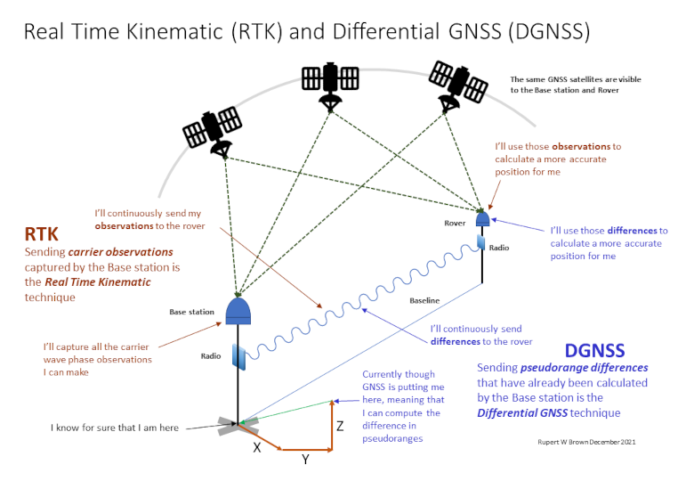

 
# Real Time Kinematic (RTK) and Differential GNSS (DGNSS) Positioning

> Real Time Kinematic (RTK) and Differential GNSS (DGNSS) positioning are quite distinct from Precise Point Positioning (PPP) which is the technique employed in Ginan. However RTK, and to an extent DGNSS, are very successful and widely used technologies. It is important to know the difference between RTK, DGNSS and PPP.

RTK and DGNSS are similar techniques in that they rely on one, or a network of receivers (base stations) whose positions are very accurately known, to calculate data that allows another receiver (the rover) to determine its position with high accuracy.

The “differencing” between the base receiver’s known position and its computed position using GNSS, allows for errors to be eliminated and thus position accuracy for the rover to be improved. Those errors are local in nature. The closer the rover receiver is to a base receiver the better i.e. tens of kilometres rather than hundreds.

The key difference is that with RTK, the base stations are sending to the rover the GNSS carrier wave measurements it is observing – carrier observations. The rover knows the true positions of the base stations. With DGNSS, the base station is sending the difference between observed and calculated pseudoranges – pseudorange differences.

RTK, and to an extent DGNSS, are very successful and widely used techniques. They have good accuracy and converge on a position quickly, but have some downsides:

* Both rely on having at least two GNSS receivers (base station and rover) which increases cost. You can buy what is in effect a "base station service" so you don't have to have the physical equipment, but that service still costs money.
* You need radio or some other form of communications to transmit the difference data.
* If you lose the difference data signal, you can lose accuracy.
* The rover has to stay within a few tens of kilometres of the base station. The further away, the less reliable the correction becomes.

*The basic principles of real time kinematic and differential GNSS positioning*

Ginan is not an RTK or DGNSS based software application. Ginan will achieve high accuracy positioning using the precise point positioning (PPP) technique.