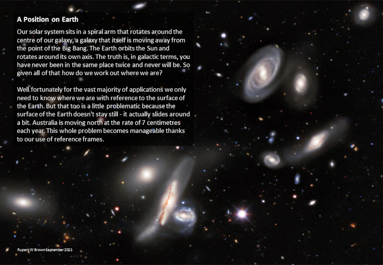
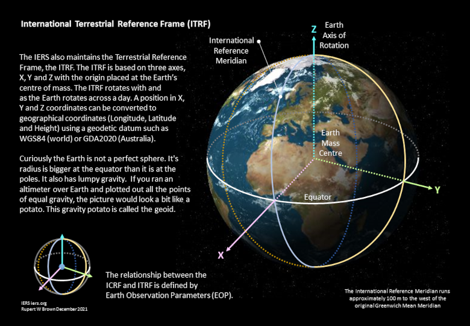

 

# A Position on Earth

> We take positions on Earth for granted but they rely on a series of well-defined and maintained reference frames. This section introduces the reference frames that let us define a point on Earth in terms of latitude, longitude and height.

*Position in an ever-moving, ever-changing Universe.*

Our Universe is expanding in all directions from the point of the big bang. Our solar system sits in a spiral arm that rotates around the centre of our galaxy. The Earth orbits the Sun and rotates around its own axis. The truth is, in galactic terms, you have never been in the same place twice and never will be. Given all of that how do we work out where we are?

Well fortunately for the vast majority of applications we only need to know where we are with reference to the surface of the Earth. But that too is a little problematic because the surface of the Earth doesn't stay still - it actually slides around a bit. Australia is moving north north-east at the rate of 7 centimetres each year. This whole problem becomes manageable thanks to our use of reference frames.

## The International Celestial Reference Frame (ICRF)

*The International Celestial Reference Frame (ICRF). J2000.0 is a standard Julian equinox and epoch - January 1, 2000 at 12:00 TT.*

The International Earth Rotation and Reference Systems Service (IERS) was created in 1988 to establish and maintain a Celestial Reference Frame, the ICRF. The ICRF is defined by the position of significant celestial objects. Perhaps the most important of these are the so-called radio-loud quasars. These are super massive black holes at the centre of galaxies that radiate huge amounts of energy. A quasar typically emits radiation with a unique signature - a pattern across the radiation spectrum. These quasars, despite all the movement, appear as fixed points in the sky and thus as fixed reference points in the ICRF.

## The International Terrestrial Reference Frame (ITRF)

*The International Terestrial Reference Frame (ICRF).*

The IERS also maintains the International Terrestrial Reference Frame, the ITRF. The ITRF is based on three axes, X, Y and Z with the origin placed at the Earth's centre of mass. The Z axis points up following the axis of the Earth's rotation (through the North Pole). The X axis passes through the point at the intersection of the International Reference Meridian (lying about 100m to the west of the original Greenwich Mean Meridian) and the Equator. The Y axis is orthogonal to both of them. The ITRF rotates with and as the Earth rotates across a day.

The relationship between the ICRF and ITRF is defined by Earth Observation Parameters (EOP).

The Earth is not a perfect sphere. Its radius is bigger at the equator than it is at the poles. It also has lumpy gravity. If you ran an altimeter over Earth and plotted out all the points of equal gravity, the picture would look a bit like a potato. That said, a position in X, Y and Z coordinates can be converted to geographical coordinates (Longitude, Latitude and Height) using a geocentric datum.

Given that Australia does move approximately 7 centimetres a year north north-east, it is important that Australia keeps track of where it is in the context of the ITRF. To this end Geoscience Australia maintains the geocentric datum GDA2020 and a suite of tools, models and resources as part of the Australian Geospatial Reference System.

## Latitude, Longitude, Height

*Points on the Earth defined by Latitude, Longitude and Height.*

We usually talk about our position on the Earth as being defined by latitude, longitude and height (in the context of a geodetic datum like GDA2020). Finding where we are on Earth in terms of latitude, longitude and height has been made much simpler and more accurate thanks to Global Navigation Satellite Systems (GNSS).

## Resources

[ Reference Frames from September 2021](resources/ReferenceFrames20211209v01.pdf)