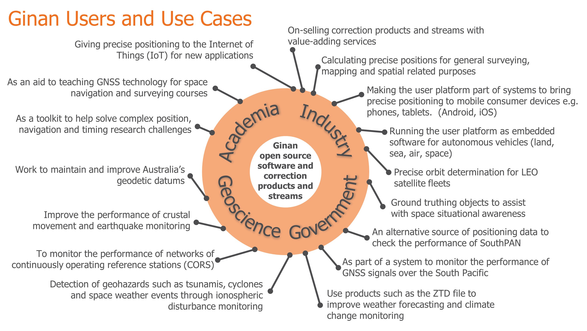
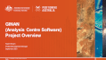

 
# Ginan: software toolkit and service

The Australian Government, through Geoscience Australia's Positioning Australia program, is funding the design, development and operational service of a Global Navigation Satellite System (GNSS) position correction system (the Ginan service and toolkit).

This system will give individuals and organisations no-cost access to software and products that have the potential to greatly enhance the accuracy of positioning – to within a few centimetres – across Australia.

The aims of the initiative are to:

* Develop a software based GNSS analysis toolkit and make it available to the public through an open source licence.
* Use that toolkit to produce position correction messages that allow users with compatible GNSS receivers and an internet connection to get to a position accuracy of a few centimetres. This is the Ginan toolkit operating in its Network Platform mode.
* Provide the toolkit in its User Platform mode which can take GNSS observations and correction messages to calculate precise positions with an accuracy of a few centimetres.
* Encourage the development of innovative position dependent technology and services that will be of economic benefit to Australia – to grow the market for original equipment manufacturers (OEMs), technology integrators, service providers, the science community and end users, and realise the full benefits of GNSS.
* Enhance Geoscience Australia’s internal expertise in multi-GNSS so that Geoscience Australia can continue to provide expert advice on GNSS system performance to domestic and international GNSS users.
* Help Geoscience Australia generate the next generation of geodetic datums, keep track of multi-GNSS performance over Australia, and produce positioning products so that Geoscience Australia can realize the full benefit of the navigation systems that operate in our region.
* Provide a state-of-art GNSS analysis toolkit to our universities and research organisations to enable Australia to lead the development of geospatial technology.

Geoscience Australia will support Ginan with ongoing maintenance and enhancements and will publish service level guarantees.

## Product offering

Ginan is being rolled out in a phased approach and will offer products in four distinct categories:

1. **The software itself.** Ginan is open-source software that Geoscience Australia has hosted on this GitHub repository. Anybody who has access to GitHub will be able to download and use the software. Selected parts of the software or the whole application may be downloaded. This is the concept behind Ginan as a toolkit. If a person is only interested in precise orbit determination, they need only take that software. By making the software open-source Geoscience Australia is:
    1. Supporting GNSS education by allowing students and researchers to examine how the Ginan algorithms work to solve complex problems,
    1. Enabling researchers and commercial organisations to use the software to solve research or commercial problems,
    1. Allowing the software to become more robust over time by giving users the ability to report bugs and make suggestions to improve the software.
1. **Standard precise point positioning (PPP) product files.** An operational version of Ginan, maintained by Geoscience Australia, will produce a range of standard PPP product files including, for example, a precise orbits and clocks file in sp3 format. Users with a Geoscience Australia account will be able to log into the Geoscience repository and download the files they require. In time these files will also be submitted to the International GNSS Service (IGS) to become part of their data set.
1. **Precise point positioning correction messages.** An operational version of Ginan, maintained by Geoscience Australia, will stream over the internet on a 24 X 7 basis, a range of PPP correction messages in the [RTCM3](https://rtcm.myshopify.com/collections/differential-global-navigation-satellite-dgnss-standards) message format (and later possibly [SPARTN](https://www.spartnformat.org/) and [IGS-SSR](https://www.igs.org/formats-and-standards)) . Users with a Geoscience Australia account will be able to select and connect to the streams they require. The data will enable corrections to be applied in real-time to achieve position accuracies of under 5 cm in equipment capable of consuming the data.
1. **New PPP products and applications yet to be defined.** The Ginan toolkit gives Geoscience Australia the ability to offer new PPP products, yet to be defined but which, in collaboration with users, may spawn new applications and commercial opportunities. Within the PPP world there are well established conventions, but these do not need to constrain innovative thought.

## Users and Use Cases

Ginan's users and use cases are summarised in the figure below:

## Collaborate

Geoscience Australia believes that Ginan is a compelling application to use for precise point positioning. Geoscience Australia is keen to hear from the positioning community regarding requirements around:

* Types of application that need to be supported,
* Novel data formats or combinations for specific applications,
* Any other aspects related to PPP technology and operations.

Contact Geoscience Australia via e-mail: clientservices@ga.gov.au - Include "Ginan" in the title.

## Resources

[ The Ginan project overview presentation from March 2022](resources/GinanProjectOverview20220316v01.pdf)
