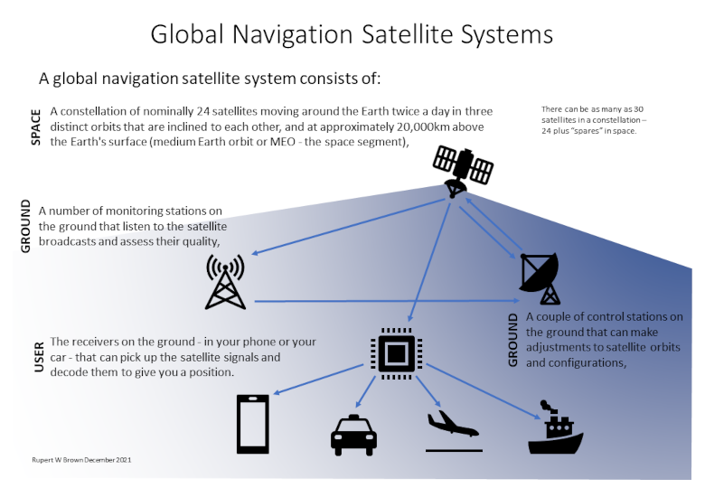
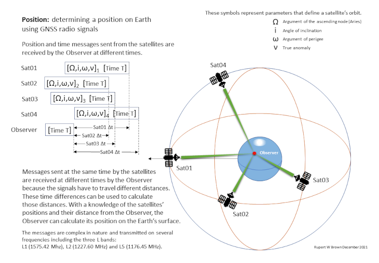
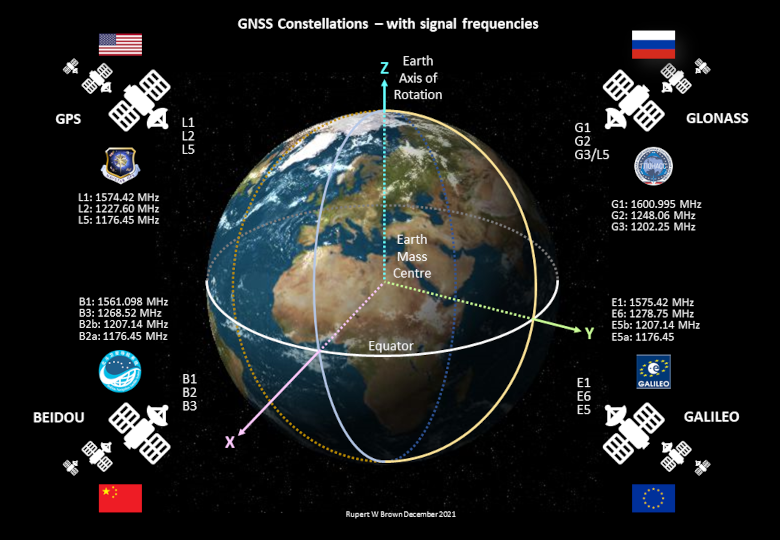

# Global Navigation Satellite Systems (GNSS)

> Global Navigation Satellite Systems `GNSS` have revolutionised the way we think about and use position information. But there is a lot more to GNSS than the phone in your hand. They are complex systems of systems. This section describes the major components that make up a GNSS.

*Global Navigation Satellite System components*

A global navigation satellite system consists of:

1. A constellation of nominally 24 satellites moving around the Earth twice a day in three distinct orbits that are inclined to each other and at approximately 20,000 km above the Earth's surface (medium Earth orbit or MEO - the space segment),
1. A number of monitoring stations on the ground that listen to the satellite broadcasts and assess their quality,
1. A couple of control stations on the ground that can make adjustments to satellite orbits and configurations,
1. The receivers on the ground - in your phone or your car - that can pick up the satellite signals and decode them to give you a position.

The clever part is that the satellites know where they are - their position in their orbit around the Earth - because the control segment uploads new computed orbits every time they pass over. The satellites continuously broadcast their orbital position along with a special timing or ranging signal.

The speed at which the radio signal travels from the satellite to Earth is known - that is the speed of light. A receiver on the ground can pick up the ranging signal and calculate how far away the satellite is from the receiver. This is called ranging. Note: the speed of light is a known constant but unfortunately other effects become the source of some position uncertainties as we'll see later.

Given that the satellite is also broadcasting its position, the receiver now has a distance and a position. If the receiver can see four satellites at one time it has enough information to use sophisticated trigonometry (trilateration) to calculate the position of the receiver.

*The basic GNSS position calculation*

## Active GNSS Constellations

There are currently four full GNSS constellations in operation:

1. Navstar Global Positioning System (GPS) - the original American system started in 1978 and achieved full operational capability in 1995. GPS orbits at 20,200 km above the Earth,
1. GLONASS from Russia - Global'naya Navigatsionnaya Sputnikovaya Sistema - since 1995. GLONASS orbits at 19,100 km above the Earth,
1. BeiDou from China since 2018. BeiDou orbits at 21,528 km above the Earth,
1. Galileo from the European Union since 2021. Galileo orbits at 23,222 km above the Earth,

*GNSS Constellations*

All of the constellations broadcast an open signal service (as opposed to an encrypted service for armed forces). It is the case that if you have a receiver that can pick up signals of different frequencies from more than one constellation, so the more confident and accurate will be your position.

## Resources

[ Global Navigation Satellite Systems](resources/GNSS20211209v01.pdf)
