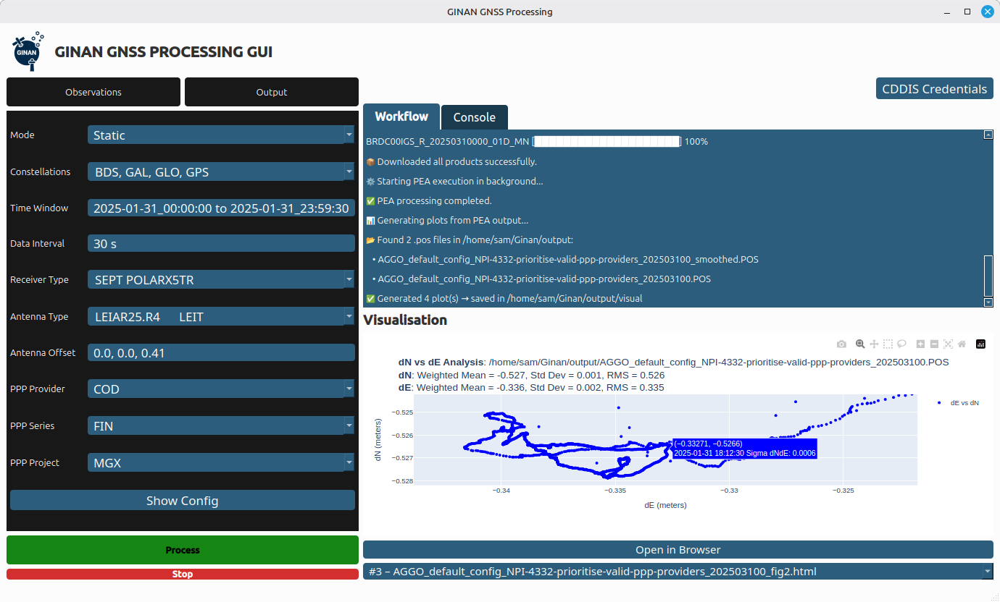

> **13 Feb 2026** - the Ginan team is pleased to release Ginan patch v4.1.1
>
> **Highlights**:
> 
> * Fix issue reading RINEX files in Windows binaries (CRLF-ended format)
> * Allow station / receivers names to start with a number in config (e.g. 4RMA00AUS)
> * Introduce reading of GLONASS satellites for RNX2 files
> * Various updates to the GUI:
>   * Apriori position as config option in interface
>   * Ability to run faster rate clocks (1 Hz -> 100 Hz)
>   * SINEX downloading and validation
>   * Verify downloads against CDDIS checksums 
>   * Use archived products if available

> **30 Jan 2026** - the Ginan team is pleased to release Ginan update v4.1.0
>
> **Highlights**:
>
> * Introduction of SouthPAN SBAS capabilities into Ginan:
>   * Choice of running L1 SBAS, DFMC (dual-frequency multi-constellation) and PVS (Precise Point Positioning Via SouthPAN)
>   * Includes SBF (Septentrio) input
>   * Included sanity check configurations for SBAS, DFMC and PVS
> * Additions to the Graphical User Interface (GUI) for Ginan - GinanUI:
>   * "Constellations" config tab for managing code priorities for the selected PPP provider/series/project
>   * Support for downloading products from the REPRO3 directory for older RINEX files
>   * Detection of supported code priorities for PPP products using the corresponding .BIA file
>   * Verification of PPP product constellations using the corresponding .SP3 file
>

> **16 Dec 2025** - the Ginan team is pleased to release v4.0.0 of the toolkit.
>
> **Main Highlights**:
>
> * Introduce Ginan binaries for Linux, MacOS and Windows
>   * The binaries can be found on the GitHub website:
>     * [Ginan Binaries](https://github.com/GeoscienceAustralia/ginan/releases/tag/v4.0.0)
> * Introduce a Qt-based Graphical User Interface (GUI) for Ginan:
>   * Simply open RNX file and choose from drop-downs
>   * Download the GUI from GitHub release page
>   * Works across Linux, MacOS and Windows
>   * Built using PySide 6
>   * A user manual for the GUI can be found here:
>     * [Ginan GUI User Manual](https://github.com/GeoscienceAustralia/ginan/tree/main/scripts/GinanUI/docs/USER_GUIDE.md)
>
> 
> *A screenshot of the Ginan GUI in action.* 
>
> **Major Changes**:
>
> * Major refactor: use OpenBLAS / LAPACK instead of Eigen
>   * Refactored RTS code
>   * Refactored core Kalman filter code
>   * Improved efficiency (up to 30% faster on network runs)
> * Major improvement in handling state errors in pre-fit and post-fit outlier screening
> * Move to vcpkg as the primary package manager for Ginan
> * Add RNX2 --> RNX3 phase signal mapping in config
>
