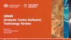

 

# Overview

> This page provides an overview of the documentation and artefacts available to support your use of Ginan.

#### Videos: 
The Ginan team have made a series of short videos to describe Ginan and help with its installation. They are:

* [Ginan Video Tutorial - Introduction](https://www.youtube.com/watch?v=oP_vk5sci1k&list=PL0jP_ahe-BFnChGLpQmXYpHNFiRze4DZR&index=2)
* [Ginan Video Tutorial - Installation](https://www.youtube.com/watch?v=FAi2fg-7tbs&list=PL0jP_ahe-BFnChGLpQmXYpHNFiRze4DZR&index=2)
* [Ginan Video Tutorial - Docker Install](https://www.youtube.com/watch?v=uW1DcIbZk1g&list=PL0jP_ahe-BFnChGLpQmXYpHNFiRze4DZR&index=3)

#### Installation: 
The written notes on how to download and install supporting packages and the Ginan software are detailed [here](page.html?c=on&p=install.index)

#### Development journey: 
Ginan is actively being developed by the team at Geoscience Australia. The features and benefits of this latest release are described in the GitHub [CHANGELOG.md](https://github.com/GeoscienceAustralia/ginan/blob/main/CHANGELOG.md)

#### Using Ginan: 
Ginan is a feature rich software application with a number of operational modes to help you achieve specific outcomes. These modes are defined by configuration files in YAML format. The Ginan team have developed a series of configuration file examples to help you understand Ginan operations. Please refer to the documents [Using Ginan](page.html?c=on&p=ginanUsage.index) 

#### Ginan science: 
Ginan employs a number of mathematical techniques to realise the GNSS theory that delivers precise point positioning. A summary (no equations) of these techniques is given in the Ginan [Technology Review](resources/GinanTechnology20220318v01.pdf). More detail (equations) is given in the Ginan [Science Manual](page.html?c=on&p=science.index).

#### Collaborate: 
Being an open source project, Geoscience Australia is keen to collaborate with organisations around the world to further develop and enhance the Ginan toolkit. One of the easiest ways to get in touch with the team is to open an [issue](https://github.com/GeoscienceAustralia/ginan/issues) in GitHub. There is a Ginan [C++ coding standard](page.html?c=on&p=codingStandard.md) if you plan on working with the source code.

#### Licence: 
Ginan is open source and is free for anybody to use. Is is under active development and testing. It is released under an [Apache 2.0 licence](https://www.apache.org/licenses/LICENSE-2.0). Please be aware of the clauses in that licence relating to warranty and liability.

## Ginan terms

> This section introduces some of the principal concepts and techniques used in Precise Point Positioning. These techniques have been developed over the years since the Global Positioning System (US GPS) went live. The technology used in positioning continues to develop and improve.

Ginan is on a development journey. That development will see Ginan be released in versions incorporating new techniques and algorithms that improve:

* The timeliness of the analysis products i.e. reduction in latency.
* The accuracy of the data within analysis products.
* The time it takes to resolve an accurate position.

Ultimately, the Ginan team aims to deliver an application that uses signals from all the GNSS constellations (multi-GNSS), can process those signals in an uncombined and undifferenced way with full carrier wave ambiguity resolution. The application will be able to work in post-processed and real-time modes to generate both PPP correction data and precise positions. Following is an introduction to the meaning of significant terms.

* The use of the term Network mode or User mode implies that Ginan has been configured as a Network Platform or User Platform.
* Network mode refers to several GNSS reference stations being used together so that the observations can be used to estimate parameters i.e. produce correction products.
* User mode refers to station observations being processed independently of each other to produce a precise position of a receiver.
* Undifferenced - observations from each reference station are processed independently, no difference is made between station observations to remove satellite clock and orbit error terms.
* Uncombined - observations are processed independently on each frequency observed. Combining frequencies is a technique used to eliminate certain factors (such as the ionosphere delay) and thus simplify equations and calculations.
* Ambiguity resolution - ambiguities are resolved, the integer number of phase cycles between the satellite and the receiver at first observation has been determined, thus aiding position accuracy.
* Post processed, data used by the platform is contained within files obtained from an archive such as the IGS archive.
* Real-time - data is processed in real-time, observations are obtained from an NTRIP caster.

## Resources

[ Ginan Technology Review](resources/GinanTechnology20220318v01.pdf)