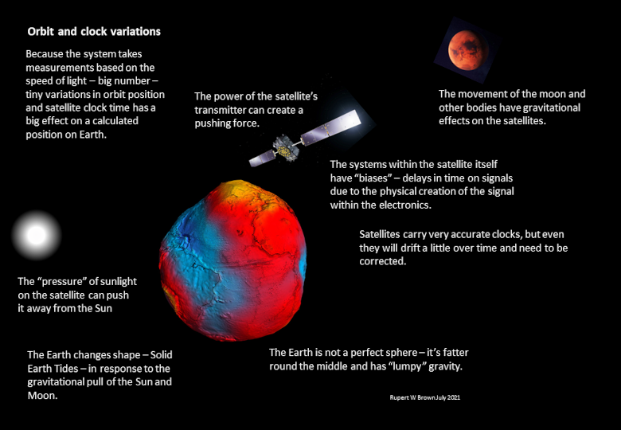
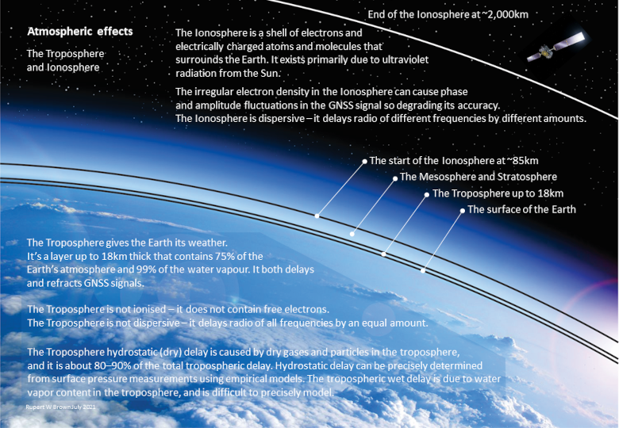
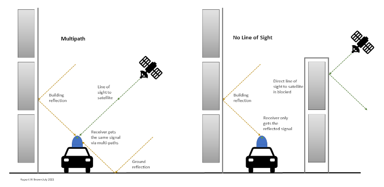
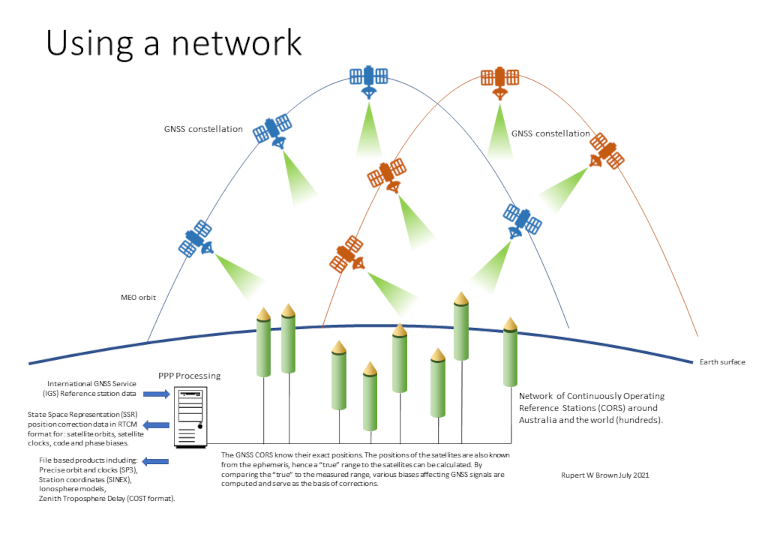
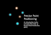

# Precise Point Positioning

> Precise Point Positioning (PPP) is a way of determining very precise positions using GNSS observations and position correction data - and of calculating that position correction data. Ginan can be used to both produce position correction data and determine precise positions.

There are several distinct parts to the process that allows us to determine a position using a GNSS. These parts include:

* The GNSS signal being created within and broadcast by the satellite,
* The passage of that signal through space and the Earth's atmosphere, and
* Its reception by a receiver on the Earth's surface.

Each one of these parts is capable of introducing elements into the process which ultimately reduces the accuracy of the position that is calculated. Precise Point Positioning (PPP) aims to understand what those elements are and build models to create corrections such that the final position is as accurate as is possible.

## Satellites in the Space Environment

*The space environment for a GNSS satellite.*

Knowing exactly where a GNSS satellite is at an instance in time is crucial for the position calculation. Because the signals travel at the speed of light (which is huge), even tiny inaccuracies in satellite position and onboard clock time can have a big impact on the final position. Unfortunately there are always some inaccuracies in satellite position and time:

* The clocks carried by GNSS satellites are incredibly accurate but even they have a tendency to drift and need to be corrected.
* Satellite orbits are shaped and perturbed by:
	* Variations in the Earth's gravity. Gravity around the globe is not uniform but rather a bit "lumpy". This lumpiness can alter the orbit of satellites.
	* The gravitational forces on the satellite from the Sun, Moon and other bodies in the solar system.
	* Light from the Sun creates a force as it strikes the satellite. This force changes as the satellite moves in and out of the light.
	* The satellite's own radio transmissions can create a pushing force which can vary depending on the power used by the transmitter.
* The electronic systems and antennas on the satellite introduce "biases" or delays between when a signal is created and actually transmitted.
* The gravitational force in space creates tides in the surface of the Earth. These tides can physically alter the height of the surface of the Earth.
* The speed at which the satellite moves means that the signal is subject to the doppler effect.

PPP software like Ginan seeks to build models that create correction data to provide very precise satellite orbits and clocks, bias and Earth tide adjustments.

## The Atmosphere

*The nature of the Ionosphere and Troposphere.*

The Ionosphere and Troposphere are quite different in their composition but both delay GNSS radio signals. That delay makes the transmitting satellite appear further away than it actually is and so reduces the accuracy of the final position. The delay adds error.

The Ionosphere is a shell of electrons and electrically charged atoms and molecules that surrounds the Earth. It is considered to start at an altitude of 85km and extend to about 2,000 km above the Earth’s surface. The Ionosphere:

* Changes the refractive index of the atmosphere and bends (thus extends) the path the signal takes,
* The presence of ions actually slows down the signal.

The effect of the Ionosphere is different for different frequencies. GNSS receivers that can decode two signals (e.g. GPS L1 and L2) can use an algorithm to remove much of the Ionosphere effect. The use of this algorithm is referred to as deriving a position which is Ionosphere-free.

PPP uses an Ionosphere model to make an adjustment for the effect of the Ionosphere. The more sophisticated the model the longer it takes to make the adjustment but the more accurate it will be. Ionosphere models typically describe four main parameters:

1. Electron density,
1. Electron temperature,
1. Ion temperature,
1. Ion composition.

The value of parameters vary by time of day, time period of the current Solar Cycle, Sunspot activity, latitude, longitude and height.

The Troposphere contains the bulk of the Earth’s atmosphere and all its weather. It starts at the Earth’s surface and extends upwards to an altitude of 18 km.

Delays to the GNSS signal caused by the Troposphere differ to the Ionosphere in one very important aspect – they are uniform across the GNSS frequencies. This means that the techniques used to create Ionosphere-free observations cannot be applied to the Troposphere. Troposphere models have to be used to adjust for delays. Models make a clear distinction between the dry and wet components of the Troposphere. The dry component, typically 90% of the delay, can be modelled accurately using temperature and pressure (gas laws). Thankfully the wet component (water vapour) contributes a fraction of the delay as it is unpredictable and complex to model accurately.

Conversely, GNSS signals can be used to make readings of the Troposphere and specifically the wet component for use in weather forecasting applications. Using very accurate satellite orbit and clock details, an Ionosphere-free model and models for the dry (hydrostatic) part of the Troposphere, it is possible to determine the effect of the wet part of the Troposphere by comparing the actual measured GNSS signal against a calculated signal.

Stars twinkle or scintillate in the sky because of dynamic changes in the Troposphere – changes which cause continuous variations to the refractive index of the atmosphere. These scintillations affect GNSS signals and are observable by receivers.

## At the Receiver

*Multipath and No Line of Sight.*

Much like the satellites that broadcast the GNSS signal, receivers also have biases. This time the delay is between the receipt of the signal at the antenna and the processing of that signal by the receiver's electronics. It is also important for the receiver to know the location of its antenna. Any calculated position will be that of the antenna.

Another phenomenon that can occur is the idea of multipath and no line-of-sight signals. GNSS signals can be reflected off the ground, bodies of water and the side of large buildings. The reflected signal has travelled further than the line-of-sight signal and so arrives at a slightly later time. This kind of interference can cause the measured position to drift or jump around as the multipath signals reach the receiver.

High quality antennas will mitigate the effects of multi-path signals.

## Creating PPP

With PPP there are two main activities:

1. The construction and operation of the correction models to produce position correction data,
1. The combination of that correction data with GNSS observable signals to calculate a position - typically with an accuracy of a few centimetres.

The trick to being able to create high quality corrections is having access to reliable, sometimes independently sourced data that supports the use of algorithms which can deliver answers to our questions. For example, we have a GNSS receiver fixed to a point on the Earth. We know very accurately the position of that receiver because we have verified its position using GNSS-independent means. We know the receiver's physical dimensions and we have good data on its biases (electronics). Co-located with the receiver is a barometer that gives us an indication of the air pressure at the site which can be used to estimate the dry component of the Troposphere. The site is free from obstructions that could cause multipath interference. When that receiver records signals from a GNSS satellite we can look up a lot of data on that satellite. Also we are not constrained to the C/A code signals. Our receiver lets us observe the actual carrier wave signal. Suddenly we have a lot of data to answer questions like:

* Is the satellite where it says it is?
* Does it look like its clock is drifting?
* What effect does the Troposphere seem to be having?

*A network of continuously operating reference stations.*

One reference station can only tell us so much. A whole network of reference stations providing many observations from many satellites gives us a rich source of data with which to work to produce correction messages. A complete PPP solution would use the results of the analysis of signal observations with other reference data to:

* Derive corrections for satellite orbital eccentricities and clock drifts,
* Remove the effects of ionospheric refraction,
* Remove signal delays caused by the troposphere,
* Use precise locations for satellite and receiver antenna phase centres - see Notes below,
* Allow for the satellite signal carrier phase wind up effect,
* Make corrections for satellite transmission power changes,
* Compensate for Earth solid tides,
* Use undifferenced and uncombined raw observations.

PPP doesn't require all of these corrections to improve accuracy. For example, just using precise satellite orbit and clock corrections will improve accuracy on their own.

These corrections are made available as file products which can be used by PPP applications for post-processing GNSS observations. Corrections are also available as streams to be consumed for the real-time application of PPP.

Notes:

* The phase centre is defined as the apparent source of signal radiation. The phase centre of an antenna is not only angle dependant (elevation and azimuth) but also depends on the signal frequency. A simple model is to assume that the phase centre differs only in the vertical axis of the antenna. Antenna manufacturers include technical sheets indicating the phase centre offsets.
* For a receiver with fixed coordinates, the wind-up effect is due to the satellite's orbital motion. As the satellite moves along its orbital path it must rotate to keep its solar panels pointing at the sun to maintain the maximum energy while the satellite antenna keeps pointing to the earth's centre. This rotation causes a phase variation that the receiver misunderstands as a range variation and which needs to be corrected.
* Occasionally GNSS constellation operators will increase or decrease the transmission power of a satellite. This can cause a slight perturbation in the satellite's orbit.

### The Benefits of PPP

PPP brings with it some valuable advantages compared to a technique like RTK:
1. PPP can provide an absolute precise position with respect to a global reference frame, like the International Terrestrial Reference Frame (ITRF), using a single receiver i.e. it does not measure position relative to another point, which itself could be moving,
1. The fact that PPP does not rely on another receiver (undifferenced) potentially makes it easier and cheaper to use,
1. Taking an undifferenced, uncombined approach reduces the amount of signal noise potentially improving accuracy,
1. PPP using carrier wave ambiguity resolution is able to achieve position accuracy on the level of few centimetres,
1. PPP produces other products of value such as Zenith Troposphere Delay (ZTD) data water vapour in the atmosphere.

Those terms undifferenced, uncombined and ambiguity resolution are discussed as part of the documentation for Ginan.

One of the challenges and opportunities faced by Ginan is to minimise the time taken to converge on a position, something that can be problematic with PPP given the complexity of the processing. 

## Resources

[ Precise Point Positioning](resources/PPP20211215v01.pdf)
