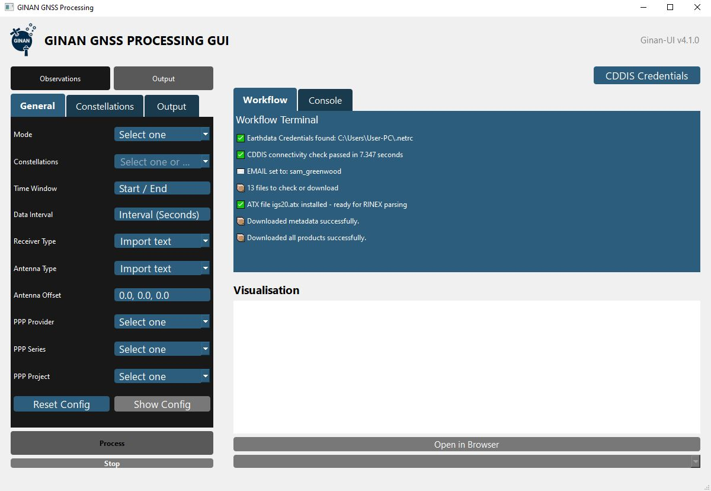
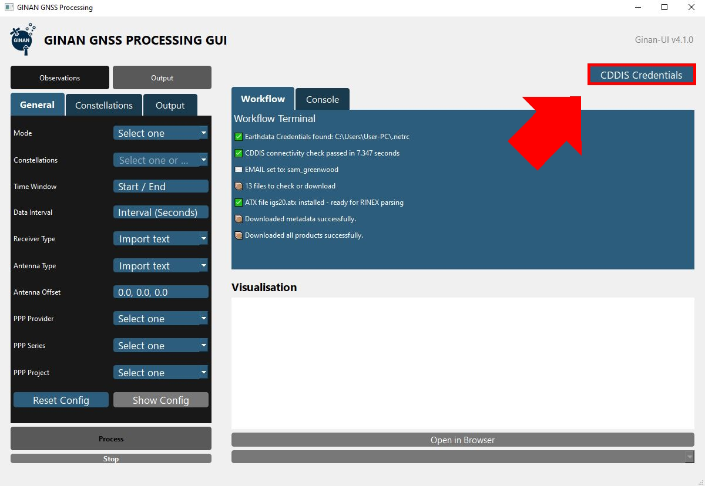
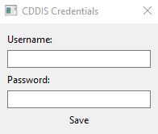
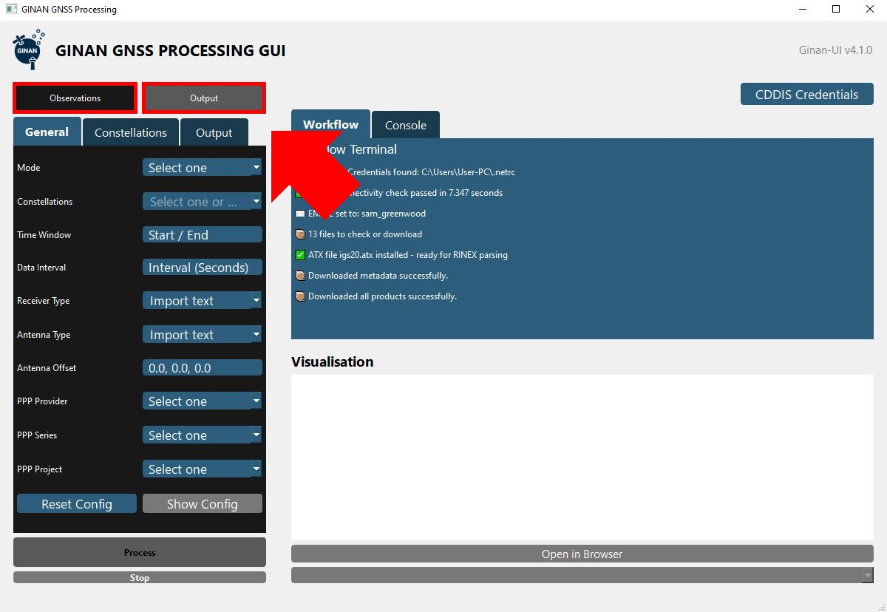
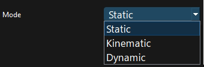
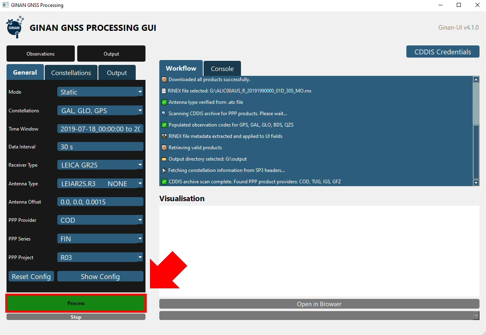
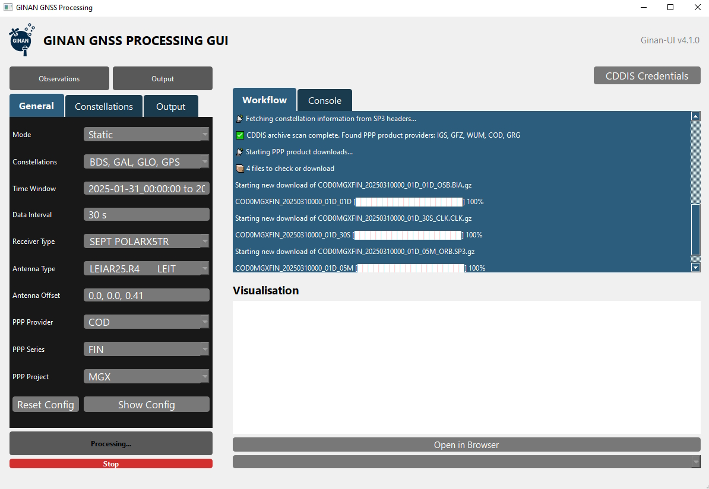
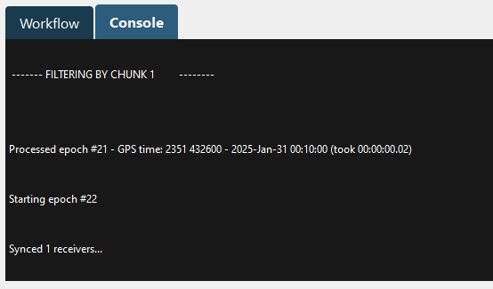
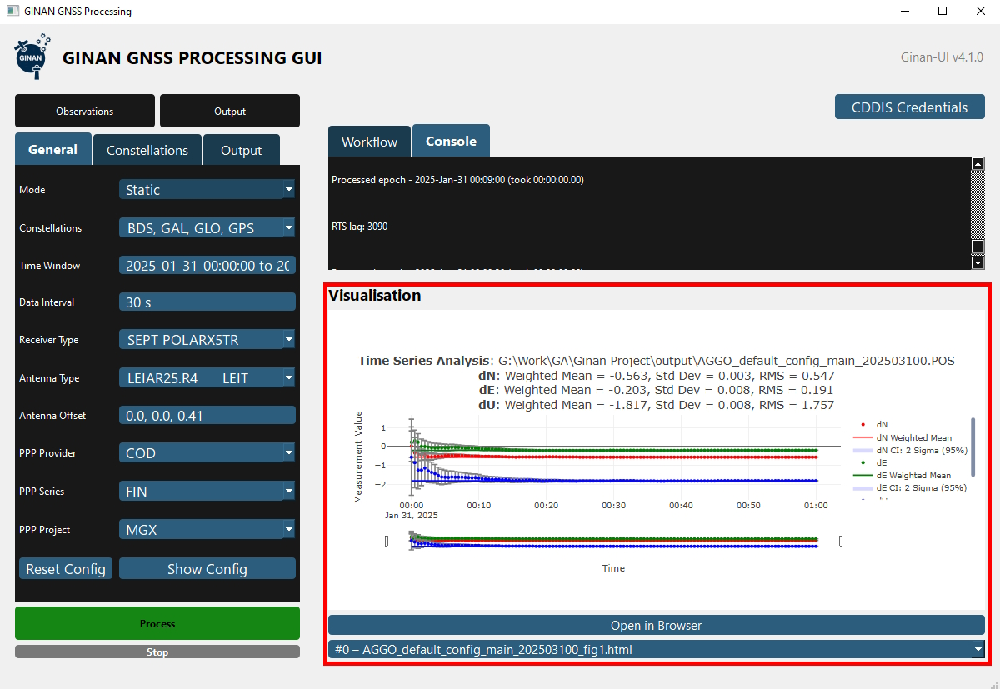
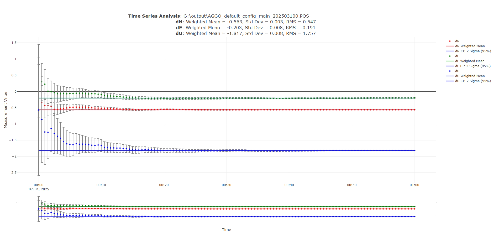

# Ginan-UI
## User Manual
### This guide is written to aid those using the Ginan-UI extension software.
### Version: Release 1.0
### Last Updated: 12th December 2025

## 1. Introduction

Ginan-UI is a graphical user interface for the Ginan software developed by Geoscience Australia. It aims to lower the barrier of entry for users trying to use the Ginan software by simplifying the users interaction with the software away from a command-line interface. On top of this, it automatically fills the .YAML configuration based on a user-provided .RNX file, automatically downloads all static and dynamic products required for execution, and also executes Ginan and visualises its plot output visualisation in an HTML format.

This tool is designed for both new users to the Ginan software who are not comfortable using Ginan in its command-line interface form, and experienced Ginan users who want to streamline their use process.

## 2. System Requirements & Installation

### 2.1 Minimum System Requirements

- OS: Mac, Linux, Windows
- CPU: 1 core, 2 threads
- Storage: 4GB
- Memory: 2GB
- Internet connection

### 2.2 Installation Guide

**It is required** to have registered credentials to access the CDDIS Archives. This is necessary to automatically download the auxiliary products and data. Once registered, enter the credentials into the CDDIS Credentials pop-up that opens on first-time launch.

If this does not open for you and the program instead opens to the main screen, check the top-right for a button that reads: "CDDIS Credentials".

#### Installation From an Executable

##### Windows

1. Download the latest Windows release from [GitHub Releases](https://github.com/GeoscienceAustralia/ginan/releases)

2. Extract the ZIP archive to your desired location

3. Run `Ginan-UI.exe`

**Windows Security Warning:** On first-time launch, Windows Defender SmartScreen may display a warning because the executable is not code-signed. This is expected behaviour for unsigned open-source software. To proceed:
1. Click **"More info"**
2. Click **"Run anyway"**

Ginan-UI is safe to run - the complete source code is available in this repository for verification.

##### MacOS

1. Download the latest macOS release from [GitHub Releases](https://github.com/GeoscienceAustralia/ginan/releases)

2. Extract the archive to your desired location

3. Remove the file from macOS quarantine:

```
bash
xattr -dr com.apple.quarantine /path/to/ginan-ui
```

4. Run the startup script, which configures environment variables and launches Ginan-UI:

```
bash
./run.sh
```

##### Linux

1. Download the latest Linux release from [GitHub Releases](https://github.com/GeoscienceAustralia/ginan/releases)

2. Extract the archive:

```
bash
tar -xf ginan-ui-linux-x64.tar.gz
cd ginan-ui
```

3. Make the executable runnable (if needed):

```
bash
chmod +x ginan-ui
```

4. Run Ginan-UI:

```
bash
./ginan-ui
```

**Note:** On some Linux distributions, you may need to install additional Qt dependencies. If you encounter missing library errors, refer to Section 7.1 (Troubleshooting).

#### Installation from Source
Follow the below commands, tested with python 3.9+

```
Install and navigate to the root of the Ginan repository:
cd /ginan
pip install -r scripts/GinanUI/requirements.txt
python -m scripts.GinanUI.main
```

## 3. Getting Started (Quick Start)

When you open Ginan-UI for the first time, you will be taken to the main dashboard interface. The workflow is straightforward and only requires a few inputs from the user before Ginan can begin processing.

<p align="center"><i>Dashboard of Ginan-UI</i></p>




To use Ginan-UI, you will require an account with NASA's CDDIS EarthData archives. Once you have created an account here, you can log in by clicking the “CDDIS Credentials” button in the top-right of Ginan-UI:

<p align="center"><i>CDDIS Credentials button in the top-right</i></p>



Then, enter your CDDIS credentials and click “Save”.

<p align="center"><i>Type in your CDDIS login credentials here</i></p>



Next, click the “Observations” button in the top-left and select the RINEX observation data file you want to process. Afterward, click the adjacent “Output” button and choose an output location for where Ginan will store its results after processing.

<p align="center"><i>Select your RINEX observation file and your output location</i></p>



Once your RINEX observation file is set, most of the UI fields should autofill based on extracted data from the RINEX file, however the user still needs to set the “Mode” parameter. This defines how much noise should be expected in the data (i.e. “Static” = stationary GNSS receiver, “Kinematic” = a moving car, “Dynamic” = a moving plane). Set this field now.

More experienced users may recognise this parameter as the `estimation_parameters.receivers.global.pos.process_noise` config value. By default, “Static” = 0, “Kinematic” = 30, and “Dynamic” = 100.

<p align="center"><i>Select a "Mode" to set the `process_noise`</i></p>



Once everything is configured and all fields have been autofilled by Ginan-UI, simply click “Process” to start Ginanʼs PEA processing. Ginan-UI will begin downloading the required products from the CDDIS servers for Ginan to process, and then will execute Ginan automatically. Ginanʼs processing progress will be displayed in the accompanying "Console" tab next to the default "Workflow" tab.

<p align="center"><i>Click "Process" when ready!</i></p>



<p align="center"><i>Ginan-UI will automatically start downloading the necessary products</i></p>



<p align="center"><i>Ginan's PEA tool will then begin processing using the selected configuration</i></p>



When Ginan finishes processing, you can view the generated position plot within Ginan-UI, or alternatively open the generated HTML output to review the results by clicking “Open in Browser”.

<p align="center"><i>Once PEA finishes processing, Ginan-UI will plot the results</i></p>



<p align="center"><i>Visualisation plot enlarged in the web-browser</i></p>



And that is it! Check out Section 6 for more in-depth tooling.

## 4. User Interface Reference

### 4.1 Input Configuration (Left Panel)

The left-hand panel contains all the configuration options required to set up Ginan to commence processing.

#### "Observations" Button

- Opens a file picker to select your RINEX v2/v3/v4 observation file (optionally can be compressed).

- Ginan-UI will automatically extract metadata from your provided RINEX file, including the time window, available constellations, and receiver and antenna type information. This metadata is then used to autopopulate the several fields below.

#### "Output" Button

- Opens a file picker to select where PEA will save its processing results (`.pos`, `.log`, HTML plots).

- Remains disabled until a valid "Observations" file has been selected.

#### Mode

- **Critical parameter** that must be set by the user.

- Defines expected receiver motion and sets the process noise parameter for position estimation:
  - **Static** (0): Stationary GNSS receiver (e.g. reference station)
  - **Kinematic** (30): Moving ground vehicle (e.g. a car)
  - **Dynamic** (100): Fast-moving vehicle (e.g. an airplane)

- Corresponds to the `estimation_parameters.receivers.global.pos.process_noise` YAML field

#### Constellations

- Drop-down showing GNSS systems detected from your RINEX file. Displays which constellations are available: GPS, GAL (Galileo), GLO (GLONASS), BDS (BeiDou), QZS (QZSS)

#### Time Window

- Displays the detected start and end epochs.

- Useful is you only want to process a subset of your observation period

#### Data Interval

- Set the interval to downsample your observation data (i.e. process every 120 seconds, instead of 30 seconds).

#### Receiver Type / Antenna Type

- Used internally for antenna phase centre corrections

#### Antenna Offset

- View / edit ENU (East-North-Up) offset values. This allows manual adjustment if your antenna has a known offset position from its reference point.

#### PPP Provider / Project / Series

- Three drop-downs that filter available products based on the provided time window

- **Provider:** Analysis centre or organisation (e.g. IGS, COD, GFZ, JPL)

- **Series:** Solution type (e.g. Ultra-rapid, Rapid, Final)

- **Project:** Product line within the provider (e.g. IGS_MGEX, CODE_MGEX)

- Changing the provider will filter the available series and projects.

- These fields are populated after a valid observation file has been loaded.

#### "Show Config" Button

- A button that opens the generated `ppp_generated.yaml` file in your system's default text editor.

- Allows advanced users to manually edit PEA configuration parameters

- See Section 6.1 for more details on manual config editing.

### 4.2 Monitoring & Output (Right Panel)

The right-hand panel contains all the monitoring tools for Ginan-UI's functionality and Ginan's processing, as well as managing your CDDIS credentials.

#### "CDDIS Credentials" Button

- Opens a dialog to enter your NASA EarthData username and password.

- This is required for downloading product from CDDIS archives.

- Credentials are validated against CDDIS servers before being saved. On success credentials are stored in a `.netrc` or `_netrc` file in your home directory (depending on the platform)

#### "Workflow" Tab

- Logs Ginan-UI workflow and automation messages as well as any warnings or errors with usage. Product download progress is displayed within progress bars.

- Text is read-only but can be selected and copied for reporting any issues.

#### "Console" Tab

- Streams the complete `stdout` / `stderr` from the Ginan PEA executable as it processes, as well as the relevant log messages.

- Text is read-only but can be selected and copied for reporting any issues.

#### "Visualisation" Section

- The visualisation panel displays an interactive HTML plot that is generated using the `plot_pos.py` script after PEA completes its processing. It allows the user to view, pan, zoom, hover over tooltips and toggle legends.

- Below the visualisation panel, the user can choose to open the plot in their system's default web-browser, or switch between the other generated plots.

### 4.3 Process Control

#### "Process" Button

- The green button in the bottom-left. Initiates Ginan's processing.

- Will remain disabled until all required inputs are configured: Valid Observation file, Output directory, Mode parameter, and PPP products available.

- Will disable when processing commences.

#### "Stop" Button

- The red button in the bottom-left. Requests a graceful termination of product downloads and PEA's execution.

- After the stop completes, the "Process" button will re-enable again.

## 5. Understanding the Ginan-UI Workflow

### 5.1 What Happens When You Click "Process"

Once all required parameters within the UI are filled and the "Process" button is clicked, Ginan-UI will begin downloading the required dynamic products from the CDDIS EarthData servers. These primarily include the `.bia`, `.clk`, `.nav (BRDC)` and `.sp3` files.

Once these have successfully downloaded, Ginan's PEA tool will be automatically executed with the generated `.yaml` configuration file. This processing can be observed within the "Console" log tab which should look similar to PEA's command-line interface output.

Once it finishes processing, the `plot_pos.py` script will be called automatically to plot the resulting `.pos` and `_smoothed.pos` files generated during processing, and the plots will appear within the UI under the "Visualisation" heading.

### 5.2 Product Downloading (Static vs. Dynamic)

Ginan-UI automatically downloads all required products for GNSS processing from NASA's CDDIS (Crustal Dynamics Data Information System) archives. These products are split into two categories: **static** and **dynamic**.

#### Static Products (Metadata)

Static products are reference files that rarely change and are downloaded once when Ginan-UI is launchd for the first time. These include:

- **ATX** (Antenna exchange format) - Antenna phase centre corrections

- **ALOAD** (Atmospheric loading) - Atmospheric pressure loading models

- **IGRF** (International Geomagnetic Reference Field) - Geomagnetic field models

- **OLOAD** (Ocean loading) - Ocean tide loading models

- **OPOLE** (Ocean pole tide) - Ocean pole tide models

- **PLANET** (Planetary ephemeris) - Solar system body positions

- **SAT-META** (Satellite metadata) - Satellite characteristics and properties

- **YAW** (Yaw attitude) - Satellite attitude models

- **GPT2** (Global Pressure and Temperature 2) - Tropospheric models

These fies are stored in `scripts/GinanUI/app/resources/inputData/products/` and are automatically archived when they become outdated (typically after one week). Fresh copies are then downloaded on the next program launch.

#### Dynamic Products (Observation-Specific)

Dynamic products are files specific to the provided RINEX observations and change based on the observation's time window and chosen PPP provider. These are downloaded each time you click "Process" and include:

- **CLK** (Clock products) - Precise satellite and station clock corrections

- **SP3** (Precise ephemeris) - Precise satellite orbit positions

- **BIA** (Bias products) - Code and phase biases for multi-GNSS processing

- **NAV** (Navigation/broadcast) - Broadcast navigation messages (BRDC files)

Ginan-UI will automatically determine which dynamic products you need based on:

1. The time window provided (either manually set or extracted from your RINEX observation file)

2. The PPP provider / series / project selected in the UI

3. The constellations present in your data (GPS, GLONASS, Galileo, BeiDou, QZSS)

#### Download Process

When you click "Process", Ginan-UI will:

1. Check your CDDIS credentials are valid

2. Query for the available products for the provided time window from the CDDIS servers

3. Download any missing dynamic products with progress indicators shown in the "Workflow" log tab

4. Verify all required products are present before launching PEA

If a product cannot be found (which is common for either very old or very new RINEX observation files), Ginan-UI will inform you that the selected provider does not have the products available for your time window yet. Different PPP providers publish their products with varying latencies. Ultra-rapid (ULT) are available within hours, Rapid (RAP) are available within about one day, and Final (FIN) may take one or two weeks.

All downloaded products are stored in `scripts/GinanUI/app/resources/inputData/products/` alongside the archived products from previous processing iterations in timestamped archive folders.

### 5.3 Product Archival

Ginan-UI will automatically archive both products and output files to prevent conflicts between processing runs and to keep your directories clean and organised.

#### Product Archival

Product files are automatically archived in the follow situations:

- **On Application Startup:** Static products older than seven days are moved to timestamped archive folders within `scripts/GinanUI/app/resources/inputData/products/archived/`. Fresh versions are then downloaded to replace them.

- **When Loading a New RINEX File:** If you select a different RINEX observation file, all dynamic products from the previous processing iteration are archived with the tag `rinex_change_[timestamp]`. This prevents incompatible products from different time windows being mixed up.

- **When Changing PPP Selections:** If you change your PPP provider, series, or project selection the relevant dynamic products will be archived with the tag `PPP_selection_change_[timestamp]`. However, reusable files like broadcast navigation messages will be preserved.

#### Output Archival

When you start a new processing run, existing output files in your selected output directory are automatically moved to `output/archive/[timestamp]/` before PEA processing commences. This includes:

- `.pos` files (position solutions)
- `.log` files (PEA execution logs)
- `.txt` and `.json` files (configuration artifacts)
- `.html` visualisation files (if a visualisation directory was used)

This makes sure that every processing iteration produces a clean output and does not overwrite results from previous iterations.

### 5.4 Where Files are Stored

Ginan-UI has several important directories for its operation. All paths are relative to the Ginan installation directory unless explicitly specified by the user (observation and output directories).

#### Product Storage

- **Location:** `scripts/GinanUI/app/resources/inputData/products/`

- **Contents:** All static and dynamic products downloaded from NASA's CDDIS Earthdata archives.

- **Subdirectories:** 
  - `tables/` - Static metadata files (ALOAD, OLOAD, GPT2)
  - `archived/` - Timestamped folders containing archived products

#### Configuration Files

- **Template:** `scripts/GinanUI/app/resources/Yaml/default_config.yaml`

- **Generated Config:** `scripts/GinanUI/app/resources/ppp_generated.yaml`

- **CDDIS Credentials:** Platform-specific (See Section 4.2)
  - Windows: `%USERPROFILE%\.netrc` or `%USERPROFILE%\_netrc`
  - MacOS / Linux: `~/.netrc`

#### Output Files

- **Location:** User-selected via the "Output" button
- **Contents:** PEA-generated `.pos` files, `.log files`, and processing artifacts
- **Visualisations:** HTML plot files generated by `plot_pos.py`
- **Subdirectories:** `archive/` - Timestamped folders containing previous run outputs

#### Observation Data

- **Location:** Selected by the user via the "Observations" button
- Ginan-UI will read but does not modify your RINEX files

### 5.5 How the YAML Config is Generated

The `.yaml` configuration file that is generated for Ginan's PEA processing originates from the template config file located within `scripts/GinanUI/app/resources/Yaml/default_config.yaml`. This template file is copied if no config file exists within `scripts/GinanUI/app/resources/ppp_generated.yaml`, or if one does exist already, the `ppp_generated.yaml` file is instead overwritten. Keep in mind however that this may maintain some artifacts from previous config generations, which can be useful in some use cases.

If you would like to instead generate a fresh `ppp_generated.yaml` file, simply delete `ppp_generated.yaml` and on the next processing run, a new config file will be generated from the `default_config.yaml` template file.

## 6. Advanced Usage

### 6.1 Manual YAML Editing

For experienced users of Ginan who need fine-grained control over Ginan's processing, the `.yaml` configuration file can be manually edited via clicking the "Show Config" button.This will open `ppp_generated.yaml` in your system's default text editor.

#### Persistence of Manual Changes

Manual user edits are preserved across most operations as Ginan-UI will only update specific fields when necessary:

- RINEX metadata (time windows, constellations, receiver / antenna information)

- Product file paths for downloaded PPP products

- Output directory paths

All other parameters like processing strategies, filter settings, quality control thresholds, satellite-specific options will all remain untouched.

**Note:** YAML artifacts may persist between sessions. For example, marker names within `receiver_options` may remain if not explicitly overwritten, though this rarely causes issues.

#### Resetting to Default

If you experience any configuration errors and want to start fresh:

1. Delete `scripts/GinanUI/app/resources/ppp_generated.yaml`

2. On the next processing run, a clean configuration file will be generated from the template at `scripts/GinanUI/app/resources/Yaml/default_config.yaml`

**For executable releases of Ginan-UI**, the config is located at `_internal/app/resources/ppp_generated.yaml`

**Warning:** Invalid YAML syntax (like incorrect indentation, mismatched quotes, and malformed lists) will cause PEA to fail. Please verify your formatting if you encounter configuration-related errors in the logs.

## 7. Troubleshooting

### 7.1 Common Issues

| Issue                                                                   | Cause                                                                                                                                                                                                      | Fix                                                                                                                                                                                                                                                             |
|-------------------------------------------------------------------------|------------------------------------------------------------------------------------------------------------------------------------------------------------------------------------------------------------|-----------------------------------------------------------------------------------------------------------------------------------------------------------------------------------------------------------------------------------------------------------------|
| Ginan-UI launched to a black screen, then crashed                       | Ginan-UI's usage of the Qt framework can rarely cause race conditions causing a segmentation fault.                                                                                                        | Try launching Ginan-UI again, it almost always fixes itself after first-time launch.                                                                                                                                                                            |
| Missing library errors on Linux (e.g., `libxcb`, `libGL`, Qt libraries) | Required Qt dependencies not installed on your distribution.                                                                                                                                               | Install Qt dependencies for your distribution:<br>**Ubuntu / Debian:** `sudo apt install libxcb-xinerama0 libxcb-cursor0 libgl1`<br>**Fedora:** `sudo dnf install qt6-qtbase qt6-qtwebengine`<br>**Arch:** `sudo pacman -S qt6-base qt6-webengine`              |
| Process button greyed out                                               | One of the following:<br>- Observations not selected (`.rnx`)<br>- Output directory not selected<br>- Analysis centers not processed yet                                                                   | Ensure you have selected an observation file and output directory. After the observation file has been selected, the analysis centers will automatically begin processing. Once the "PPP Provider" field has been populated, the button will unlock.            |
| Missing products or downloading duplicate products when process clicked | Output directory same as product directory or log message suggesting a file is downloaded when its just being existence checked.                                                                           | Ensure output directory is separate from the product directory. If there's no product directory selection made, the product directory path is `ginan/scripts/GinanUI/app/resources/inputData/products`.                                                         |
| Program crash when clicking "Process"                                   | "`Core dump whilst thread ''`" occurs when the user uses the "Stop" button before the first download has started and subsequently clicked the process button again before the thread has a chance to exit. | The thread cannot exit whilst raising a request for status. Wait a few seconds for the "stopped thread" message in the Console before clicking Process again.                                                                                                   |
| Connection reset errors                                                 | CDDIS server timeouts and / or network problems.                                                                                                                                                           | Wait 30 seconds and then try again. If the issue persists, check your network connection. Note: CDDIS servers experienced reliability issues during the 2025 US government shutdown.                                                                            |
| CDDIS authentication failed                                             | Invalid or expired Earthdata credentials, or credentials not properly saved to `.netrc` / `_netrc` file.                                                                                                   | Re-enter your credentials via the "CDDIS Credentials" button. Verify your account is active at [Earthdata Login](https://urs.earthdata.nasa.gov). Check that `.netrc` or `_netrc` exists in your home directory with correct permissions (0600 on Linux/macOS). |
| PEA configuration error / YAML syntax error                             | Manual edits to the YAML config contain syntax errors (incorrect indentation, mismatched quotes, malformed lists).                                                                                         | Verify your YAML formatting in the config editor. If errors persist, delete `ppp_generated.yaml` to reset to default template (see Section 6.1).                                                                                                                |
| Plots not appearing in Visualisation panel                              | PEA processing failed before generating `.pos` files, or `plot_pos.py` script encountered errors.                                                                                                          | Check the Console for PEA errors. Verify that `.pos` files exist in your output directory. If files exist but plots don't render, check for Qt WebEngine issues in the Console.                                                                                 |
| Disk space errors during processing                                     | Insufficient disk space for downloading products or writing PEA outputs.                                                                                                                                   | Free up disk space. Products can consume several GB depending on time window and number of constellations. Check available space in both the products directory and your selected output directory.                                                             |

### 7.2 Log Message Interpretation

The "Workflow" / "Console" log in the right panel displays real-time output from Ginan-UI's processing. These logs redirect what would normally appear in the terminal.

#### What You Will See

The logs stream messages from them:

- **Product downloading:** URLs being fetched, file names, and download progress.

- **Ginan PEA execution:** The complete `stdout / stderr` from the PEA executable as it processes your data.

- **Toast notifications:** User feedback messages about the status of operations.

#### When Things Go Wrong

Common issues you may see in the logs:

- **Network / Connection errors:** CDDIS server timeouts or network problems. Wait 30 seconds and retry.

- **Missing products:** The selected PPP Provider may not have products available for your time window, or they haven't been published yet.

- **YAML configuration errors:** Syntax errors may cause PEA to fail on startup if you have manually edited the `.yaml` config file.

- **Disk space issues:** Ginan-UI has encountered problems when disk space is very limited. Please ensure you have at least a 2 - 3 Gb of disk space free.

#### Tips

- The logs are read-only, but you can select and copy text for reporting issues.

- It auto-scrolls to the newest output.

- Messages will persist until you start a new processing run.

- The raw PEA output can be verbose (very verbose), this is normal for GNSS processing tools.

If you encounter persistent errors, please copy the relevant log outputs when reporting issues (See Section 7.3)

### 7.3 Where To Get Help

If you encounter issues not covered in this troubleshooting guide, or need assistance with Ginan-UI:

#### Primary Contact

Sam Greenwood (Ginan-UI Engineer) - samuel.greenwood@ga.gov.au

#### Additional Resources

GitHub Issues: Report bugs or request features at the [Ginan-UI](https://github.com/GeoscienceAustralia/ginan) repository issue tracker

Ginan Documentation: For questions about Ginan itself (not the UI), consult the main [Ginan documentation](https://geoscienceaustralia.github.io/ginan/)

CDDIS Support: For issues with NASA Earthdata credentials or archive access, visit the [CDDIS help page](https://www.earthdata.nasa.gov/centers/cddis-daac/contact)

When reporting issues, please include:
- Your operating system and version
- The steps you took before encountering the problem
- Any error messages from the Workflow / Console logs
- Screenshots if relevant

**Note:** Ginan-UI was developed as part of the ANU TechLauncher program in collaboration with Geoscience Australia. For general enquiries about Geoscience Australia's GNSS analysis capabilities, visit [www.ga.gov.au](www.ga.gov.au)

## 8. FAQ

Here are some answers to the frequently asked questions:

**Q:** *"Where are products downloaded to?"*

**A:** Products are downloaded to: `ginan/scripts/GinanUI/app/resources/inputData/products`. Current static products are stored here. Dynamic products are downloaded to the same folder but are moved to an archive folder on app-startup and when the `.rnx` file changes.

**Q:** *"Where is the `.yaml` config file stored?"*

**A:** : The `.yaml` config file used by PEA is in `ginan/scripts/GinanUI/app/resources/ppp_generated.yaml` which can be edited with the "Show Config" button. The template file in `ginan/scripts/GinanUI/app/resources/Yaml/default_config.yaml` is copied and used when no `ppp_generated.yaml` can be found.

**Q:** *"Why is pea giving me a configuration error?"*

**A:** This could be due to a product file being deleted erroneously, which would resolve on the next click of the "Process" button, or due to manual changes to the `.yaml` config file. The app **does not overwrite** the `ppp_generated.yaml` file when the `.rnx` file is changed or when the app is restarted. If you wish to reset to the default config, delete the file in `ginan/scripts/GinanUI/app/resources/ppp_generated.yaml` and then run the app again.

**Q:** *"Where can I learn more about Ginan itself?"*

**A:** Visit Ginan's GitHub [here](https://github.com/GeoscienceAustralia/ginan) to learn more about the tool!

## 9. Acknowledgements
This project was designed during the Australian National University's TechLauncher program in 2025. Ginan-UI was created for Geoscience Australia by:

- Sam Greenwood
- Ryan Foote
- Harry Baard
- Kenita Tan
- Yuliang Yang
- Fan Jin
- Songxuan He

Special thanks to Simon McClusky at Geoscience Australia for their continuous support and guidance throughout the project's development.