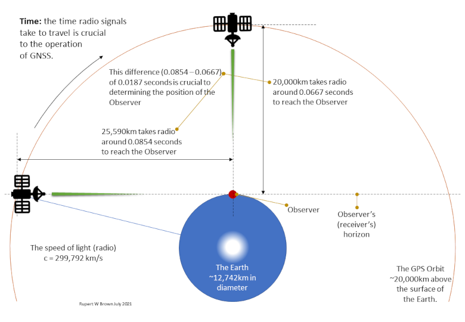
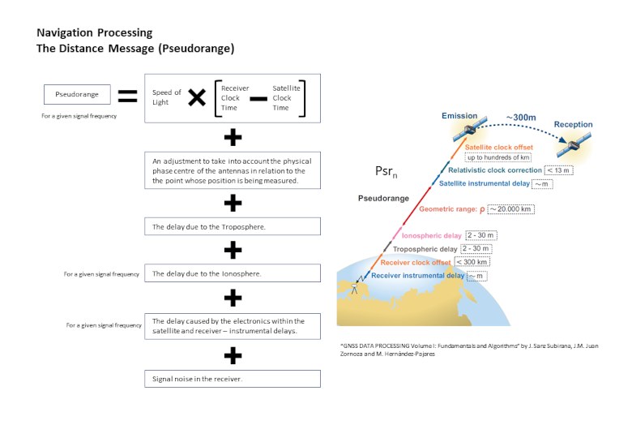
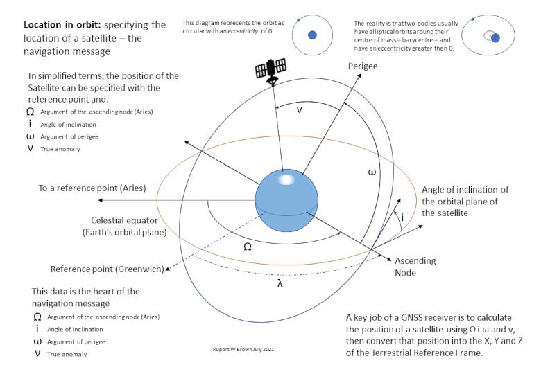
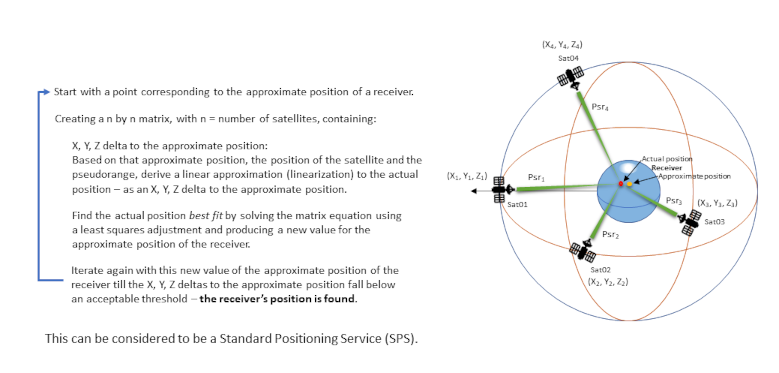

# Standard Positioning Service

> Our experience of positions from satellites will almost certainly be thanks to the `Standard Positioning Service`. This brilliant concept was pioneered by the US Global Positioning System (GPS) and provides free positions across the globe with an accuracy of a few meters. This section describes how that service works.

The GNSS constellations offer a number of different services. The one that will be familiar to most people is the Standard Positioning Service (SPS). This is the service that is open, free and used by smartphones and car navigation devices. Other GNSS services offer higher position accuracy but are usually encrypted and reserved for special purposes such as the military. This page describes the SPS and its accuracy.

The GPS SPS [Performance Standard](https://www.gps.gov/technical/ps/) defines the SPS as:

> The SPS is a positioning and timing service that is available for peaceful civil, commercial, and scientific use. It includes the C/A-code signal, the CM/CL-code signals, and the I5-code/Q5-code signals. The C/A-code signal is transmitted by all satellites and comprises an L1 carrier modulated by a coarse/acquisition (C/A) code ranging signal with a legacy navigation (LNAV) data message. The ...

The definition goes on to describe the CM/CL-code and I5-code/Q5-code signals, but for this purpose an exploration of the coarse/acquisition (C/A) code is sufficient.

## C/A-codes and modulation

To make sense of the Standard Positioning Service (SPS), it is important to understand the C/A-code concept and how it is used to transmit the information required for ranging, and thus determining a position.

Like any other radio message, GNSS signals are transmitted by the satellites at certain frequencies. The best known of these is called L1 which is a frequency of 1575.42 Mhz. It is also referred to as a carrier wave frequency - "carrier" because it is used to carry other information to a receiver.

A carrier wave can be used to carry information by modulating its frequency - modulation gives the carrier wave a shape that represents the information. The shape is understood by the receiver and recovers the information.

Every GNSS satellite is allocated a unique Pseudo Random Noise (PRN) code (C/A-code) which is modulated onto the satellite's carrier wave frequency.

The position of the satellite in its orbit around the Earth is contained within a navigation message. The data in this message is overlaid on the C/A-code. A GNSS receiver can identify the satellite through the PRN code and decode the navigation message. Timestamps informing the receiver when the satellite sent the message, are embedded as part of the modulation process.

Thus the receiver can determine where the satellite is, and how far it is from the satellite. If a receiver can see four or more satellites and has at least four sets of satellite positions and distances, it can calculate its position.

*Representing the navigation message and C/A-code being modulated on to the carrier wave.
By P. F. Lammertsma, converted to vector by Denelson83 - Satellite Navigation, P. F. Lammertsma, p. 9, CC BY-SA 3.0,
https://commons.wikimedia.org/w/index.php?curid=1383669*

## The SPS Process

The basic process stages for the Standard Positioning Service (SPS) are:

* The systems on the ground - the monitoring and ground control stations - maintain a very close watch on the GNSS satellites in orbit. Central processing systems calculate very precise satellite orbits and adjustments to satellite clocks which are broadcast to the satellites as they pass over ground control stations.
* The satellites use the data from the ground control stations and create their GNSS signal. They modulate the carrier wave with their PRN (C/A-code) and the navigation message, and broadcast to Earth on a continuous basis.
* A receiver picks up the GNSS signals. A receiver has a number of channels. Each channel can process the data from one satellite.
* The receiver decodes the GNSS signals. The receiver identifies the satellite by decoding its PRN code and matches it to a list of known satellites. It determines the position of that satellite, and how far it is from the satellite, from the navigation message and timestamp information.
* Algorithms are used to turn these satellite positions and distances into a series of X, Y and Z coordinates.
* Trigonometry, specifically a technique called trilateration, turns the X, Y and Z coordinates and distances of several satellites into the X, Y and Z position of the receiver.
* Finally the receiver can translate its own X, Y and Z coordinates into latitude, longitude and height (using reference frames).

Note there is a difference between the PRN code - which is lots of ones and zeros - and the PRN number - which is a regular integer. A GNSS satellite is typically referred to by its PRN number and that satellite will broadcast its signals encoding them using its PRN code.

## Signals and the Speed of Light

*The time it takes for a GNSS signal to reach Earth's surface.*

A signal from a GNSS satellite, in a 20,000 km orbit passing directly over us, takes around 0.0667 seconds (66.7 mS) to reach Earth's surface. A signal from that satellite as it appears over the horizon takes approximately 0.0854 seconds (85.4 mS) to reach the same spot. The difference between the two is a mere 0.0187 seconds (18.7 mS) but that difference is crucial when it comes to computing the distance between our GNSS receiver and the satellite. The receiver has to be able to calculate that distance to work out its position.

## Distance - Pseudorange

*Pseudorange components.*

Up to this point the term "distance" has been used when talking about the space between the GNSS satellite and the receiver. There is a "true distance" between the satellite and receiver that could be measured in meters but in practice it doesn't work quite that way.

The distance between the satellite and the receiver is calculated by multiplying the speed of light by the time it takes for the GNSS signal to travel from the satellite to the receiver. This distance calculation is pretty good but isn't the whole story. Other effects cause the distance to appear larger than it actually is.

For this reason the distance between satellite and receiver is called the pseudorange. "Pseudo" because it isn't a simple value of distance. The figure above shows the most significant components that go to make the complete pseudorange value.

The greatest part of the pseudorange is the true distance between the satellite and the receiver. But the Ionosphere, the Troposphere and delays (biases) in the electronic equipment itself contribute to making the pseudorange appear longer than the true distance - sometimes by hundreds of meters. This can have an adverse effect on the calculated position of the receiver.

## The Navigation Message

Defining a satellite's orbital position.

A satellite's position in its orbit is defined by the values associated with a number of key parameters as shown in the figure above. This orbital position is broadcast by the satellite as part of its navigation message. As has been discussed, the satellite's position is important data in allowing a receiver to calculate a position.

## Carrier waves and Codes

The SPS relies on a receiver being able to receive, interpret and measure the C/A-code signals along with the navigation message. As we'll see in the discussion around Precise Point Positioning (PPP) later, the carrier wave itself can also be used as a means of determining the distance between a satellite and the receiver.

For this reason the C/A-code and carrier wave are known as the two main observables in GNSS positioning. Both the C/A-codes and the carrier wave can be used for ranging, even though original GNSS systems were never designed to exploit the carrier wave for positioning. Inexpensive GNSS receivers can measure the codes. More expensive and sophisticated devices are needed to measure the carrier wave.

A question for you: if all the GNSS satellites are broadcasting on the same frequencies, how come the signals don’t get mixed up? How does a receiver know which signal comes from which satellite?

The answer to this puzzle lies in understanding how Code Division Multiple Access (CDMA) works. Every GNSS satellite is allocated the entire transmission band all of the time. The trick is that each satellite’s message is coded using their unique PRN code. The key to CDMA is the receiver's ability to extract the desired signal while rejecting everything else as random noise.

PRN codes are designed to be very orthogonal to one another. That means that codes only correlate (can be matched) when they are almost exactly aligned. A receiver knows all the codes and identifies satellites when comparisons it performs as part of its processing result in strong correlations. The [allocation of PRN codes](https://www.gps.gov/technical/prn-codes/) is controlled by the US Space Force.

In CDMA, each message bit (like a bit of the navigation message) is subdivided into a number of short intervals called chips. Each satellite is assigned a unique 1,023 bit chip sequence which is its PRN code. To transmit 1 bit (of the navigation message), a satellite sends its chip sequence. To transmit a 0 bit, it sends the one's complement of its chip sequence. For example, if satellite A is assigned the chip sequence 00011011, it sends a 1 bit by sending 00011011 and a 0 bit by sending 11100100.

For GPS, the navigation message is sent at the very sedate rate of 50 bits per second. The rate at which the chips are sent (the chipping rate) is 1.023 megabits per second. This means that a chip (PRN code) is transmitted in a millisecond.

Putting it another way, the PRN code is like a key. Receivers have all the keys and compare incoming messages with locally generated codes (keys). There is a timestamp on each chip of the PRN code. So PRN codes from the satellite have satellite atomic clock generated time stamps and the receiver have internally generated time stamps.

## Calculating a position

*Calculating a GNSS position.*

The situation: our receiver can see four or more satellites in the sky and can decode their signals. It has calculated four sets of distances and orbital positions. It has a rough idea as to where it is - perhaps the receiver remembers where it was last turned on. The receiver uses the mathematical techniques of trilateration, linear approximation and a least squares best fit to nudge from the initial position to its actual position. It is able to do this in a dynamic way as the satellites move across the sky and the receiver moves across the Earth. This basic technique represents the Standard Positioning Service.

## How accurate is the Standard Positioning Service?

A [report](https://www.nstb.tc.faa.gov/reports/PAN96_0117.pdf#page=22) produced by the US William J. Hughes Technical Center for the US Federal Aviation Administration in 2017 states that the Standard Position Service gives a position that is:

* Within 3.9 m of the actual vertical position 95% of the time, and
* Within 1.9 m of the actual horizontal position 95% of the time.

That sounds pretty good. However, the actual performance you experience depends on many things including, but not limited to:

* The quality of your receiver. The quality of your GNSS antenna and the electronics behind it can have significant impacts on performance,
* The number of satellites your receiver can see. Generally the more satellites, the more data, the better the position,
* Multi-path effects. If the satellite signals are bouncing around nearby structures, the reflected signals can confuse the receiver,
* The accuracy of the navigation message transmitted by the satellite. If, for whatever reason, the satellite clock is a little bit off, or the satellite is a little out of its orbit then the calculated position can be thrown out too.
* The atmosphere. Both the ionosphere and troposphere can have effects on the signals which can add errors to a position.

The other signals and codes broadcast by GNSS satellites can improve that accuracy. Now there are also augmentation systems available which send additional signals that greatly improve accuracy and often carry signal integrity information. Some of these are available to the general public and some are not.

Ginan is concerned with a technique called Precise Point Positioning (PPP). PPP aims to be able to compensate for many sources of error and so greatly increase position accuracy - from metres to a few centimetres. 

## Resources

[ GNSS Standard Positioning Service.](resources/SPS20211216v01.pdf)
